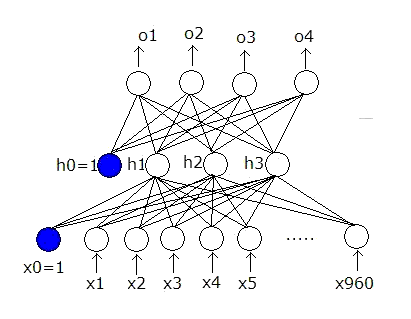
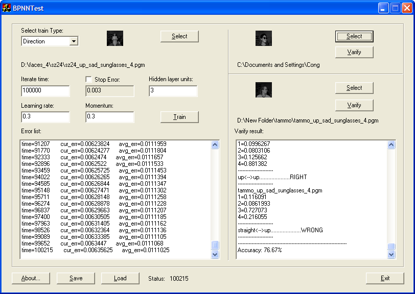

# BPNN

BPNN is a three layers C++ class of Back Propagation Neural Networks. This class has a few useful features, such as persistence (save and read trained weights into file).

## Code
The [common](./facerecognization/common/) folder contains:
- The BPNN class (namely CBPNN, file: BPNN.h and BPNN.cpp)
- The PGMFile class (namely CPGMFile, file: PGMFile.h and PGMFile.cpp)
- The file [facerecognization.dsw](./facerecognization/facerecognization.dsw) is the Visual Studio 6 (VS6) solution, open it in VS6 to build the demo.
  - WTL (Microsoft's open source Window Template Library) is used for the UI of the demo, so if you are using VS6, which will require you to install WTL separately. I haven't tested it on other newer VS version and WTL, but they shall be fine or easy to build with minor modifcation if needed (I always believe MS does really good job on back compatibilty in their SDK and Tools).

In the package, I also provided an ActiveX control to display pgm format image and an ATL/WTL based face recognition demo (Created by Visual Studio 6). This project can be adapted for artificial intelligence class for senior undergraduate students and graudate students.

## Screenshots

The demo can be built by Visual Studio 6 (all project files are provided in this repo), you can run the demo to train and test demo with CMU pgm format face images. The following is a screenshot captured when running the demo:

